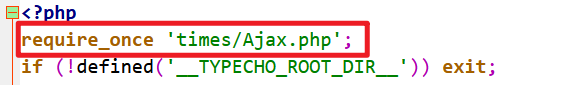
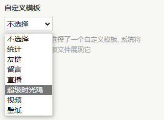

# typecho-dynamic

### 使用前必看

这是一个适用于typecho框架、Joe主题（其他主题没有试过，不保证兼容性）的页面，用原作者的话来说叫“时光机”，我是没有搞明白为什么叫了这个名字，但是这不重要。重要的是这个页面可以作为博主的朋友圈/QQ空间，去写那些比较短而且不适合放在博客文章中的内容。

本仓库Fork自[gogobody/typecho-whisper: typecho 时光机单页 (github.com)](https://github.com/gogobody/typecho-whisper)，在原作者的基础上修改了部分内容：

* 添加了页面头部
* 修改了页脚，添加鱼群游动的动画

页面预览：[碎碎念 - Roookie博客 | 记录 · 收纳 · 分享 (wlplove.com)](https://www.wlplove.com/self-talking.html)


### 怎么用

简单写写，更详细的内容

* 将 `times` 文件夹和 `page.whisper.php` 文件放到 Joe 主题目录下

* Joe 主题目录下的 **function.php** 文件头添加一行代码：

  ```php
  require_once 'times/Ajax.php';
  ```

  

* 在博客后台，新建独立页面，就会发现在自定义模板选项中多出来了一个页面模板

  

这个页面也可以使用 API 来发送信息，从而在微信、QQ 或者南博 app 上写动态。相关教程及接口信息请参考原仓库：[gogobody/typecho-whisper: typecho 时光机单页 (github.com)](https://github.com/gogobody/typecho-whisper)

